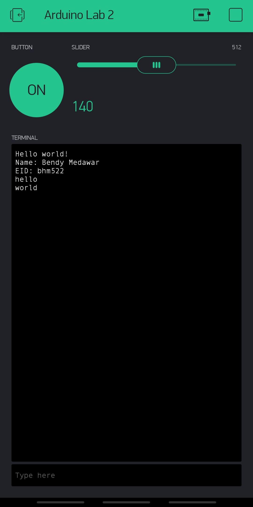

Name: Bendy Medawar

EID: bhm522

Team Number: F2

## Questions

1. What is the purpose of an IP address?

    A unique IP address is given to a machine connected to the Internet that serves the
	purpose of identifying a device so that other machines can learn and address that specific
	machine.

2. What is a DNS? What are the benefits of using domain names instead of IP addresses?

    Domain Name Service: A service that maps a name to an IP address, similar to labels and memory address.
	Easier for humans to deal with, giving a symbolic name to a long string of numbers.

3. What is the difference between a static IP and a dynamic IP?

    A static IP is an IP address that does not change while a dynamic IP address changes over
	time or upon connection to a network.

4. What is the tradeoff between UDP and TCP protocols?

    TCP is more reliable and provides error handling while UDP does not check for errors 
	but has less latency.

5. Why can't we use the delay function with Blynk?

    Blynk is event based which means a delay function will disrupt timing

6. What does it mean for a function to be "Blocking"?

    Nothing else can running while that function is running.

7. Why are interrupts useful for writing Non-Blocking code?

    Allows other threads of a program to be run during the time an equivilent function
	that is blocking in nature would waste and only shifts execution briefly from the main
	thread to service the Non-Blocking code.

8. What is the difference between interface and implementation? Why is it important?

   An interface is how a user interacts or calls a function or service while implementation
   is software that describes or executes a service's intended functionality. 
   This is important for this lab because Blynk provides the interface for functions it calls
   upon read/write operations on virtual pins but the user provides the software to a function
   to implement a task or service.

9. Screenshot of your Blynk App:

    
